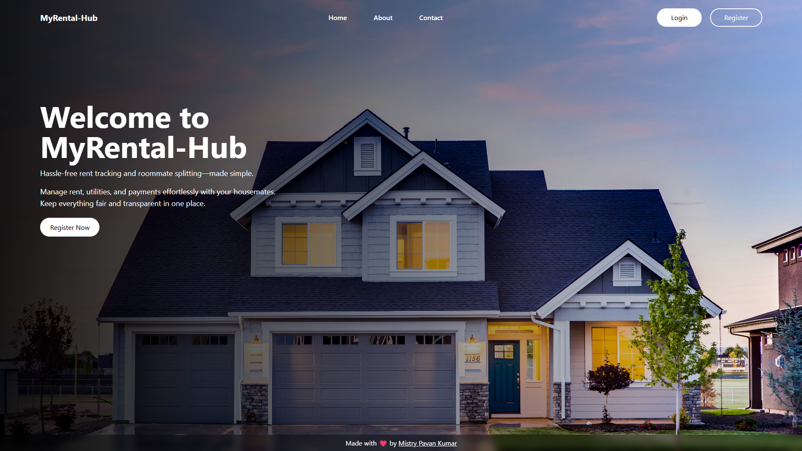
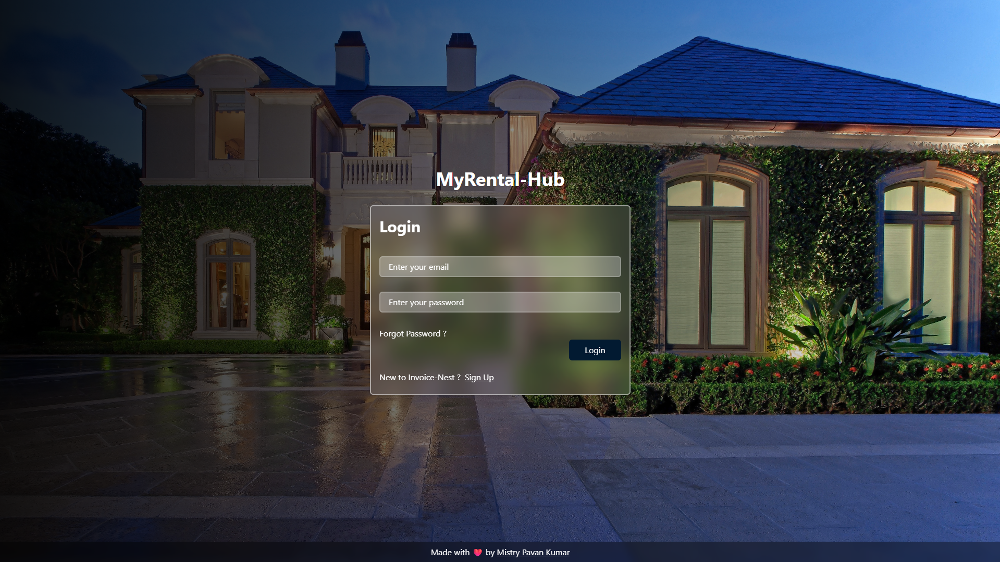
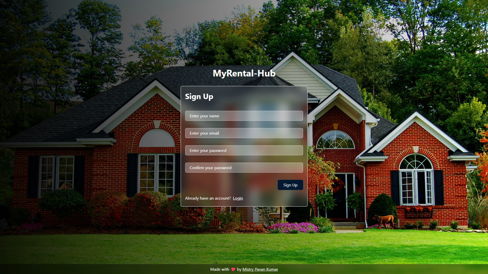
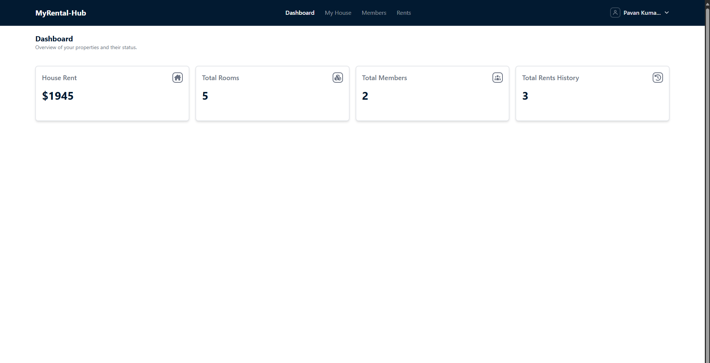
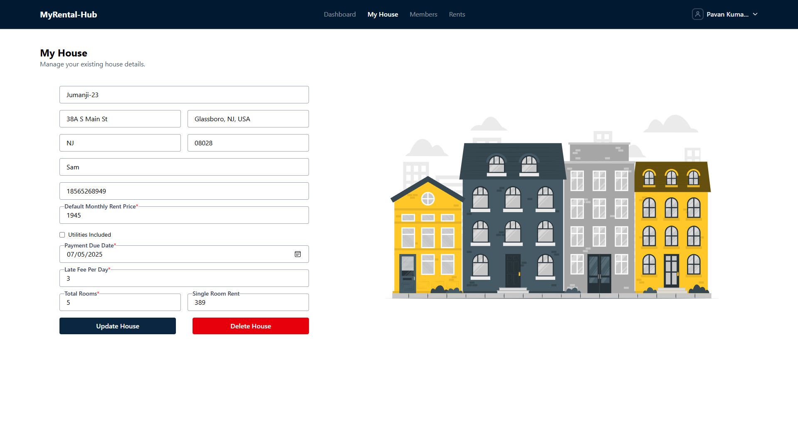
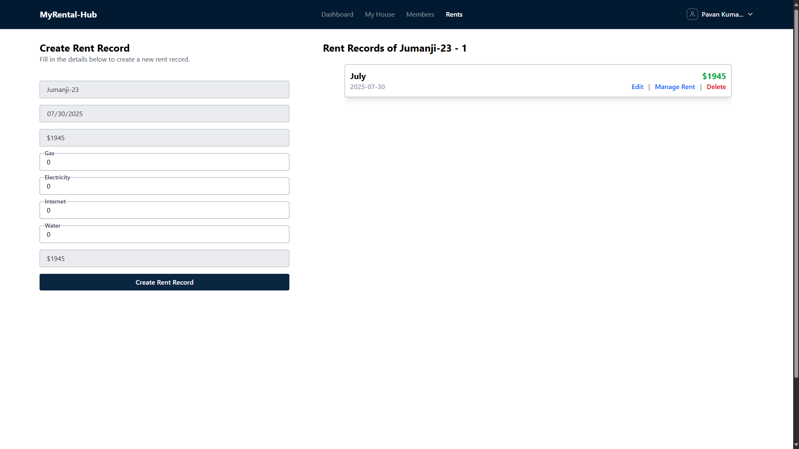
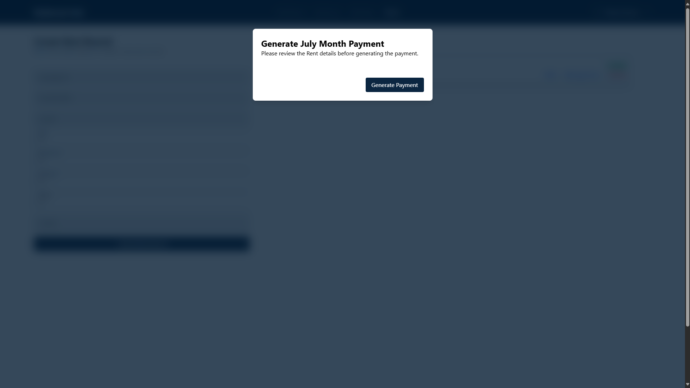
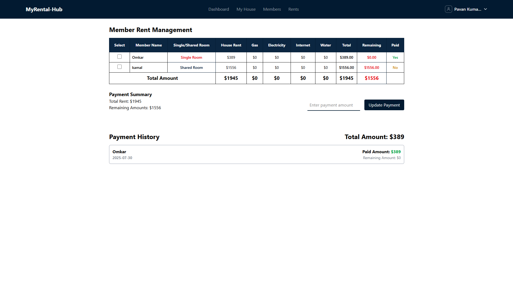

# 🏠 MyRental-hub

MyRental-hub is a powerful full-stack web application designed to simplify and streamline rent management for shared living spaces. With this platform, users can create multiple houses, add and manage tenants, generate monthly rents, split utility bills, and track rent payments—all from one centralized dashboard.

## 😎 Web Screenshot

<div style="display: flex; gap: 10px; margin-bottom: 10px; justify-content: center;">
  
</div>

<div>
  
  
</div>

<div style="display: flex; gap: 10px; margin-bottom: 10px; justify-content: center;">
  
   
</div>

<div style="display: flex; gap: 10px; margin-bottom: 10px; justify-content: center;">
  
 
</div>

<div style="display: flex; gap: 10px; margin-bottom: 10px; justify-content: center;">
  
    
</div>

## 🚀 Features

- 🏘️ **Create & Manage Houses**  
  Add and maintain details for multiple rental properties.

- 👥 **Add Members (Tenants)**  
  Assign tenants to specific houses and track their rent obligations.

- 💰 **Generate Monthly Rent**  
  Automatically calculate total rent per house and split it evenly (or manually) across tenants.

- 🔄 **Rent Split Logic**  
  Utility charges (gas, electricity, internet, water) are proportionally divided among tenants.

- 📊 **Track Payments**  
  Record who paid, how much, and when. Easily view remaining or overdue amounts.

- 📱 **WhatsApp Notifications** _(Coming Soon)_  
  Notify members about rent dues or confirmations.

- 🔒 **Admin Authentication**  
  Secure login for managing properties and tenants.

## 🧰 Tech Stack

**Frontend:**

- [Next.js](https://nextjs.org/) (App Router)
- [Tailwind CSS](https://tailwindcss.com/)
- React Context API

**Backend/API:**

- Next.js API Routes
- [MongoDB](https://www.mongodb.com/) with Mongoose
- RESTful API integration

**Deployment:**

- [Vercel](https://vercel.com/)
- MongoDB Atlas

## 🛠️ Installation & Setup

1. **Clone the Repository**

   ```bash
   git clone https://github.com/mistrypavankumar/my-rental-hub.git
   cd my-rental-hub
   ```

2. **Install Dependencies**

   ```bash
   npm install
   ```

3. **Environment Variables**
   Create a `.env.local` file and add the following:

   ```env
   MONGODB_URI=your_mongodb_connection_string
   JWT_SECRET=your_jwt_secret
   ```

4. **Run the Development Server**

   ```bash
   npm run dev
   ```

5. Visit [http://localhost:3000](http://localhost:3000) in your browser.

## 📁 Folder Structure

```
my-rental-hub/
├── app/                  # Next.js App Router
│   ├── api/              # API Routes
│   ├── (main)/dashboard/ # UI Pages for Dashboard
|   |-- ...
├── components/           # Reusable UI Components
├── lib/                  # Utility functions/constants
├── models/               # Mongoose Models
├── services/             # API & Backend services
├── public/               # Static assets and images
└── redux/                # Redux state management
```

## 📌 Future Improvements

- 🔔 Notification system via WhatsApp or email
- 📱 PWA support for mobile use
- 🧾 Invoice download for monthly rent
- 🔎 Filtering and advanced analytics for payment history

## 🧑‍💻 Author

- **Pavan Kumar Mistry**  
  🔗 [Portfolio](https://pavankumarmistry-portfolio.vercel.app) | [GitHub](https://github.com/mistrypavankumar) | [LinkedIn](https://linkedin.com/in/pavan-kumar-mistry-5067b21b1)

## 🪪 License

This project is licensed under the [MIT License](LICENSE).

---

> 💬 Feel free to open issues or submit pull requests for suggestions and improvements!
